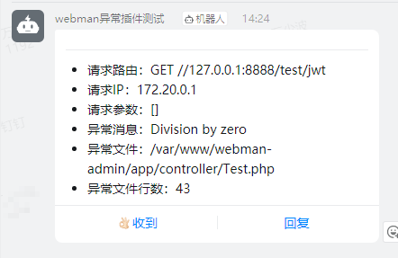

# ThinkPHP6.0 exception 异常插件

[](https://packagist.org/packages/tinywan/think-exception)
[](https://packagist.org/packages/tinywan/think-exception)
[](https://packagist.org/packages/tinywan/think-exception)
[](https://packagist.org/packages/tinywan/think-exception)
[]()
[]()

## 安装

```phpregexp
composer require tinywan/think-exception
```

## 配置

### 发布配置

```phpregexp
php think tinywan:exception
```
这将自动生成 `config/exception.php` 配置文件。

### 配置异常类

日志服务 `app/provider.php`

```php
return [
    'think\exception\Handle' => tinywan\Handler::class,
];
```

日志订阅 `app/event.php`

```php
return [
    // 添加一个订阅类
    'subscribe' => [
        \tinywan\subscribe\ExceptionSubscribe::class,
    ],
];
```

## 基本用法

请求参数错误
```php
use tinywan\exception\BadRequestHttpException;

class Token {
    public function issueToken(Request $request): Response
    {
        $params = $request->post();
        if (empty($params)) {
            throw new BadRequestHttpException('账号或密码不能为空');
        }
    }
}
```
以上异常抛出错误信息，如下格式：
```json
HTTP/1.1 400 Bad Request
Content-Type: application/json;charset=utf-8

{
    "code": 0,
    "msg": "账号或密码不能为空",
    "data": {},
}
```
> 所有返回的异常信息将以json格式返回，以上为`返回简略的异常信息`

所有的异常错误处理器根据配置文件 `config/app.php`中`debug`的值来调整错误显示， 当`debug`值为`true` (表示在调试模式)， 错误处理器会显示异常以及详细的函数调用栈和源代码行数来帮助调试，将返回详细的异常信息。 当`debug`值为`false`，只有错误信息会被显示以防止应用的敏感信息泄漏，将返回简略的异常信息。

返回详细的异常信息
```json
HTTP/1.1 400 Bad Request
Content-Type: application/json;charset=utf-8
        
{
    "code": 0,
    "msg": "password不允许为空",
    "data": {
        "request_url": "POST //127.0.0.1:8888/oauth/issue-token",
        "timestamp": "2022-03-06 15:19:12",
        "client_ip": "172.18.0.1",
        "request_param": {
            "username": "webman"
        },
        "error_message": "password不允许为空",
        "error_trace": "#0 /var/www/tinywan-admin/app/functions.php(68): Tinywan\\Validate\\Validate->check(Array)\n#1 /var/www/webman-admin/app/controller/Authentication.php(25): validate(Array, 'app\\\\common\\\\vali...')\n#2 /var/www/webman-admin/vendor/workerman/webman-framework/src/App.php(234): app\\controller\\Authentication->issueToken(Object(support\\Request))\n#3 /var/www/webman-admin/app/middleware/AccessControlMiddleware.php(26): Webman\\App::Webman\\{closure}(Object(support\\Request))\n#4 /var/www/webman-admin/vendor/workerman/webman-framework/src/App.php(228): app\\middleware\\AccessControlMiddleware->process(Object(support\\Request), Object(Closure))\n#5 /var/www/webman-admin/vendor/workerman/webman-framework/src/App.php(137): Webman\\App::Webman\\{closure}(Object(support\\Request))\n#6 /var/www/webman-admin/vendor/workerman/workerman/Connection/TcpConnection.php(638): Webman\\App->onMessage(Object(Workerman\\Connection\\TcpConnection), Object(support\\Request))\n#7 /var/www/webman-admin/vendor/workerman/workerman/Events/Select.php(295): Workerman\\Connection\\TcpConnection->baseRead(Resource id #254)\n#8 /var/www/webman-admin/vendor/workerman/workerman/Worker.php(2417): Workerman\\Events\\Select->loop()\n#9 /var/www/webman-admin/vendor/workerman/workerman/Worker.php(1541): Workerman\\Worker->run()\n#10 /var/www/webman-admin/vendor/workerman/workerman/Worker.php(1383): Workerman\\Worker::forkOneWorkerForLinux(Object(Workerman\\Worker))\n#11 /var/www/webman-admin/vendor/workerman/workerman/Worker.php(1357): Workerman\\Worker::forkWorkersForLinux()\n#12 /var/www/webman-admin/vendor/workerman/workerman/Worker.php(549): Workerman\\Worker::forkWorkers()\n#13 /var/www/webman-admin/start.php(87): Workerman\\Worker::runAll()\n#14 {main}"
    }
}
```

## 自定义异常 Response

只支持修改`body`的三个字段的key值。必须保持顺序是：
- ① 状态码
- ② 错误消息
- ③ 响应数据

> 使用场景
- 每个项目有标准的统一输出，自定义返回内容
- 前后端分离：前端要求返回的 `HTTP状态码`并不是 `429`，而是 `200` 或者其他
- 响应的`body`不是 `{"code":0,"msg":"Too Many Requests"}`，而是 `{"error_code":200,"message":"Too Many Requests"}` 等其他内容

### 自定义HTTP状态码

编辑 `config/exception.php` 文件的 `status` HTTP 状态码

### 自定义`body`返回内容

编辑 `config/exception.php` 文件的 `body` 的字段

**默认选项是**

```json
{
	"code": 0,
	"msg": "Too Many Requests",
	"data": null
}
```
**自定义选项参考一**

1、假设`status` HTTP 状态码设置为 `200`

2、假设`body`的数组设为为

```php
'body' => [
	'error_code' => 200,
	'message' => '请求太多请稍后重试'
]
```

则响应内容为
```json
HTTP/1.1 200 OK
Content-Type: application/json;charset=UTF-8

{
	"error_code": 200,
	"message": "请求太多请稍后重试"
}
```
其他的可以根据自身业务自定义即可

## 扩展自己的 Handler

当项目需要自定义情况比较多的时候，很可能需要扩展 Handler，此时可以继承 `tinywan\Handler` 然后修改对应方法即可。

> 使用场景
- response需要响应`xml`，而不是json格式，只需要覆盖`buildResponse`方法
- 扩展其他Exception的响应，我只要覆盖`solveExtraException`
- 要异常推送微信消息，我可以覆盖`triggerNotifyEvent`

自定义异常 `ErrorHandler`

```php

namespace app\common;

use Throwable;
use tinywan\Handler;

class ErrorHandler extends Handler
{
    /**
     * @desc: 重写处理扩展的异常，增加自己的异常
     * @param Throwable $e
     * @author Tinywan(ShaoBo Wan)
     */
    protected function solveExtraException(Throwable $e): void
    {
        // 用户中心异常处理
        if ($e instanceof \ErrorException) {
            $this->errorMessage = '用户中心异常：'.$e->getMessage();
            $this->errorCode = 400;
            return;
        }
        parent::solveExtraException($e);
    }
}
```

## 异常通知（钉钉机器人）



## Other

### phpstan

```phpregexp
vendor/bin/phpstan analyse src
```

### vendor/bin/php-cs-fixer fix src

```phpregexp
vendor/bin/php-cs-fixer fix src
```
